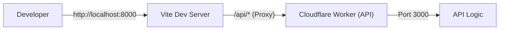
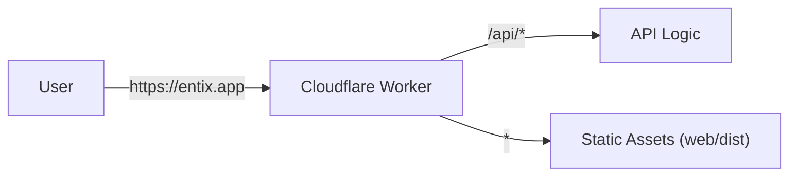

# Entix-App

Entix-App is a full-stack application built on **Cloudflare Workers** (API) and **Vite + React** (frontend).

## Table of Contents

1. [Overview](#overview)
2. [Quick Start](#quick-start)
3. [Environment Variables](#environment-variables)
4. [Architecture](#architecture)
5. [Project Structure](#project-structure)
6. [Database](#database)
7. [Better Auth Setup](#better-auth-setup)
8. [Routing Architecture](#routing-architecture)
9. [Error Handling & Validation](#error-handling--validation)
10. [Development Workflow](#development-workflow)
11. [Deployment](#deployment)
12. [Scripts Reference](#scripts-reference)
13. [API Documentation](#api-documentation)

---

## Overview

This is a full-stack web application where:
- **Backend API**: Hosted on Cloudflare Workers
- **Frontend**: Built with Vite and React
- **Database**: Cloudflare D1 (SQLite)

**Development**: Runs as two separate processes (Vite + Wrangler) for fast iteration.  
**Production**: Deployed as a single Cloudflare Worker serving both API and static assets.

---

## Quick Start

### Setup
Install dependencies for both root and web projects:

```bash
npm run dev:init
```

### Run Development Server
Start both API and web servers:

```bash
npm run dev
```

- **Web**: [http://localhost:8000](http://localhost:8000)
- **API**: [http://localhost:3000](http://localhost:3000)

### Initialize Database
The local database is automatically created by Miniflare when you:
1. Start `npm run dev`
2. Hit an API endpoint that accesses the database

After the database is created, apply migrations:

```bash
npm run db:migrate:development
```

---

## Environment Variables

### Local Development Configuration

Create a `.dev.vars` file in the project root for local development environment variables.

**Example `.dev.vars`:**

```bash
# Local D1 Database Identifier
# This is the SQLite filename created by Miniflare in .wrangler/state/v3/d1/miniflare-D1DatabaseObject/
CLOUDFLARE_D1_LOCAL_DB=your-database-id-here.sqlite

# Better Auth Configuration
BETTER_AUTH_URL=http://localhost:3000
BETTER_AUTH_SECRET=your-secret-key-here-min-32-chars

# Resend Configuration
RESEND_API_KEY=re_123456789
```

**Important Notes:**
- `.dev.vars` is gitignored and should **never** be committed
- This file is only used for local development
- The `CLOUDFLARE_D1_LOCAL_DB` variable tells Drizzle which local SQLite file to use
- The `BETTER_AUTH_URL` should match your local API server URL
- The `BETTER_AUTH_SECRET` must be at least 32 characters for security
- To find your database ID, check `.wrangler/state/v3/d1/miniflare-D1DatabaseObject/` after running `npm run dev` and hitting a database endpoint

---

## Architecture

### Development Architecture
In development, two separate servers run concurrently. Vite proxies API requests to the Worker.



### Production Architecture
In production, a single Worker handles both API requests and static file serving.



---

## Project Structure

```
entix-app/
 ├── api/              # Worker API source code
 ├── web/              # Vite + React frontend
 ├── shared/           # Shared DTOs, Zod schemas, types
 ├── wrangler.jsonc    # Cloudflare Worker configuration
 └── package.json      # Root package manager config
```

### Shared Code
The `shared/` directory contains code used by **both** `api/` and `web/`:
- Zod schemas for validation
- TypeScript types and DTOs
- Shared utilities

**Import**: `import { UserDTO } from "@shared";`  
**Build**: No build step required; resolved automatically by `vite-tsconfig-paths` and Wrangler.

---

## Database

### Environments
The project uses **Cloudflare D1** (SQLite) across three environments:

| Environment | Database | Binding |
|:---|:---|:---|
| **Development** | Local SQLite (Miniflare) | `DB` |
| **Staging** | `entix-app-staging` (Cloudflare D1) | `DB` |
| **Production** | `entix-app-production` (Cloudflare D1) | `DB` |

All environments use the same binding name: `DB`.

### Local Database (Development)

**Location**: `.wrangler/state/v3/d1/miniflare-D1DatabaseObject/`

The local database is **automatically created** by Miniflare, but only after:
1. `npm run dev` is running
2. An API endpoint that accesses the database is hit

**Important**: Drizzle must point to this exact SQLite file for migrations to work correctly.

#### Handling Local Database Drift

If you encounter issues where migrations appear applied but tables are missing:

1. **Stop** the dev server
2. **Delete** `.wrangler/` directory
3. **Restart** `npm run dev`
4. **Hit** a database-backed endpoint (to recreate the DB file)
5. **Re-apply** migrations: `npm run db:migrate:development`

### Database Tools

- **Drizzle Kit**: Generates migration files (`.sql`) from `schema.db.ts`. **Never applies migrations.**
- **Wrangler**: Applies migrations to local and remote databases.

**Rule**: Drizzle generates, Wrangler applies.

### Database Workflow

1. **Modify schema**: Edit `api/db/schema.db.ts`
2. **Generate migration**: `npm run db:generate`
3. **Apply migration**:
   - Development: `npm run db:migrate:development`
   - Staging: `npm run db:migrate:staging`
   - Production: `npm run db:migrate:production`

---

## Resend Email Setup

To enable email verification and password reset, you need to configure Resend:

1. **Sign up** at [resend.com](https://resend.com)
2. **Create API Key** and add it to your `.dev.vars` file:
   ```bash
   RESEND_API_KEY=re_123456789
   ```
3. **Verify Domain** (Production only):
   - Add DNS records provided by Resend to your domain DNS
   - Update `fromEmail` in `api/services/email.service.ts` if using a custom domain

---

## Better Auth Setup

This project uses [Better Auth](https://www.better-auth.com/) for authentication, configured specifically for **Cloudflare Workers** and **D1 databases**.

### Architecture Overview

Better Auth is integrated into the application with a **dual-configuration architecture**:

1. **Runtime Configuration** ([api/lib/better-auth/index.ts](file:///Users/david/Documents/Developer/entix-app/api/lib/better-auth/index.ts))
   - Used by the Cloudflare Worker at runtime
   - Connects to Cloudflare D1 via Drizzle ORM
   - Receives environment bindings dynamically

2. **CLI Configuration** ([better-auth.config.ts](file:///Users/david/Documents/Developer/entix-app/better-auth.config.ts))
   - **Temporary file** used only for running Better Auth CLI commands
   - Connects to the local SQLite database in `.wrangler/state/`
   - Required for generating migrations during initial setup

### Why Two Configurations?

Cloudflare Workers have a unique runtime environment that differs from traditional Node.js applications:

| Aspect | Cloudflare Workers | Traditional Node.js |
|:---|:---|:---|
| **Database Access** | Via bindings (`env.DB`) | Direct connection strings |
| **Environment Variables** | Injected at runtime | Loaded from `.env` files |
| **File System** | No file system access | Full file system access |

**The Problem**: Better Auth's CLI tools (like `npx @better-auth/cli generate`) expect a traditional Node.js environment with file system access and direct database connections.

**The Solution**: We maintain two separate configurations:
- **Runtime config** for the Worker (uses D1 bindings)
- **CLI config** for migration generation (uses direct SQLite access)

> [!IMPORTANT]
> The `better-auth.config.ts` file is **only needed during initial setup** when generating Better Auth migrations. Once migrations are created and applied, this file can be safely deleted.

### Configuration Files

#### Runtime Configuration

**File**: [api/lib/better-auth/index.ts](file:///Users/david/Documents/Developer/entix-app/api/lib/better-auth/index.ts)

```typescript
import { betterAuth } from "better-auth";
import { drizzleAdapter } from "better-auth/adapters/drizzle";
import { drizzle } from "drizzle-orm/d1";
import { betterAuthOptions } from "./options";
import * as schema from "./../../db/schema.db";

export const auth = (env: CloudflareBindings) => {
    const db = drizzle(env.DB, { schema });

    return betterAuth({
        ...betterAuthOptions,
        baseURL: env.BETTER_AUTH_URL,
        secret: env.BETTER_AUTH_SECRET,
        emailAndPassword: {
            enabled: true,
        },
        database: drizzleAdapter(db, { provider: "sqlite" }),
    });
};

export const mountBetterAuth = (app: AppOpenApi) => {
    app.on(["GET", "POST"], "/api/v1/auth/*", (c) => auth(c.env).handler(c.req.raw));
}
```

**Key Points**:
- ✅ Uses Cloudflare D1 binding (`env.DB`)
- ✅ Receives environment variables from Worker runtime
- ✅ Dynamically creates auth instance per request
- ✅ This is the **permanent** configuration

#### CLI Configuration (Temporary)

**File**: [better-auth.config.ts](file:///Users/david/Documents/Developer/entix-app/better-auth.config.ts)

```typescript
import Database from "better-sqlite3";
import { drizzle } from "drizzle-orm/better-sqlite3";
import { drizzleAdapter } from "better-auth/adapters/drizzle";
import { betterAuth } from "better-auth";
import { betterAuthOptions } from "./api/lib/better-auth/options";
import { config as loadEnv } from "dotenv";

loadEnv({ path: ".dev.vars" });

const d1DatabaseName = process.env.CLOUDFLARE_D1_LOCAL_DB;
if (!d1DatabaseName) throw new Error("Missing CLOUDFLARE_D1_LOCAL_DB");

const url = `./.wrangler/state/v3/d1/miniflare-D1DatabaseObject/${d1DatabaseName}`;

const sqlite = new Database(url);
const db = drizzle(sqlite);

export const auth = betterAuth({
    ...betterAuthOptions,
    baseURL: process.env.BETTER_AUTH_URL!,
    secret: process.env.BETTER_AUTH_SECRET!,
    database: drizzleAdapter(db, { provider: "sqlite" }),
});
```

**Key Points**:
- ⚠️ Uses `better-sqlite3` for direct file access
- ⚠️ Points to local `.wrangler/state/` database
- ⚠️ Loads environment variables from `.dev.vars`
- ⚠️ **Only used for CLI commands** (not runtime)

### Environment Variables

Add these to your `.dev.vars` file for local development:

```bash
# Better Auth Configuration
BETTER_AUTH_URL=http://localhost:3000
BETTER_AUTH_SECRET=your-secret-key-here-min-32-chars

# Local D1 Database (required for better-auth.config.ts)
CLOUDFLARE_D1_LOCAL_DB=your-database-id.sqlite
```

For **staging** and **production**, add these as environment variables in the Cloudflare dashboard or via Wrangler secrets:

```bash
# Staging
wrangler secret put BETTER_AUTH_URL --env staging
wrangler secret put BETTER_AUTH_SECRET --env staging

# Production
wrangler secret put BETTER_AUTH_URL --env production
wrangler secret put BETTER_AUTH_SECRET --env production
```

### Database Schema

Better Auth requires four tables in your database. These are defined in [api/db/schema.db.ts](file:///Users/david/Documents/Developer/entix-app/api/db/schema.db.ts):

1. **`user`** - User accounts
2. **`session`** - Active user sessions
3. **`account`** - OAuth provider accounts and password hashes
4. **`verification`** - Email verification tokens

The schema follows Better Auth's requirements while using Drizzle ORM conventions.

### Initial Setup Workflow

> [!WARNING]
> This workflow is **only needed once** during initial Better Auth integration. After migrations are created, you don't need to repeat these steps.

1. **Install Dependencies**
   ```bash
   npm install better-auth
   npm install -D @better-auth/cli
   ```

2. **Define Database Schema**
   - Create Better Auth tables in `api/db/schema.db.ts`
   - Follow Better Auth's schema requirements

3. **Generate Drizzle Migration**
   ```bash
   npm run db:generate
   ```
   This creates a migration file in `api/db/migrations/`

4. **Apply Migration to Local Database**
   ```bash
   npm run db:migrate:development
   ```

5. **Create CLI Config** (Temporary)
   - Create `better-auth.config.ts` in project root
   - Point to local `.wrangler/state/` database

6. **Generate Better Auth Migration**
   ```bash
   npx @better-auth/cli@latest generate
   ```
   This ensures Better Auth's internal schema matches your database

7. **Verify Setup**
   - Test authentication endpoints at `/api/v1/auth/*`
   - Check that sessions are created correctly

8. **Clean Up** (Optional but Recommended)
   - Delete `better-auth.config.ts` once migrations are complete
   - Keep a backup copy in this README (see below)

### Migration Reference (For Future Use)

If you need to regenerate Better Auth migrations in the future, here's the complete `better-auth.config.ts` file:

<details>
<summary>Click to view better-auth.config.ts</summary>

```typescript
import Database from "better-sqlite3";
import { drizzle } from "drizzle-orm/better-sqlite3";
import { drizzleAdapter } from "better-auth/adapters/drizzle";
import { betterAuth } from "better-auth";
import { betterAuthOptions } from "./api/lib/better-auth/options";
import { config as loadEnv } from "dotenv";

loadEnv({ path: ".dev.vars" });

const d1DatabaseName = process.env.CLOUDFLARE_D1_LOCAL_DB;
if (!d1DatabaseName) throw new Error("Missing CLOUDFLARE_D1_LOCAL_DB");

const url = `./.wrangler/state/v3/d1/miniflare-D1DatabaseObject/${d1DatabaseName}`;

const sqlite = new Database(url);
const db = drizzle(sqlite);

export const auth = betterAuth({
    ...betterAuthOptions,
    baseURL: process.env.BETTER_AUTH_URL!,
    secret: process.env.BETTER_AUTH_SECRET!,
    database: drizzleAdapter(db, { provider: "sqlite" }),
});
```

**Usage**:
1. Create this file in project root
2. Ensure `.dev.vars` has `CLOUDFLARE_D1_LOCAL_DB` set
3. Run `npx @better-auth/cli@latest generate`
4. Delete the file after migration is complete

</details>

### Authentication Endpoints

Better Auth automatically provides these endpoints at `/api/v1/auth/*`:

| Endpoint | Method | Description |
|:---|:---|:---|
| `/api/v1/auth/sign-up/email` | POST | Register with email/password |
| `/api/v1/auth/sign-in/email` | POST | Sign in with email/password |
| `/api/v1/auth/sign-out` | POST | Sign out current session |
| `/api/v1/auth/session` | GET | Get current session |
| `/api/v1/auth/verify-email` | POST | Verify email address |

### Common Issues & Solutions

#### "Cannot find name 'mountBetterAuth'"

**Cause**: Missing import in `api/app.ts`

**Solution**: Add the import and mount the auth routes:

```typescript
import { mountBetterAuth } from "./lib/better-auth";

const app = createApp();
configureOpenApi(app);
mountBetterAuth(app);  // Add this line
mountRoutes({ app, routes, prefix: '/api/v1' });
```

#### "No configuration file found"

**Cause**: Running Better Auth CLI without `better-auth.config.ts`

**Solution**: 
- If generating migrations: Create `better-auth.config.ts` (see reference above)
- If migrations are done: You don't need to run CLI commands anymore

#### Database Schema Mismatch

**Cause**: Better Auth's expected schema doesn't match your Drizzle schema

**Solution**:
1. Ensure your schema matches Better Auth requirements
2. Run `npm run db:generate` to create Drizzle migration
3. Run `npm run db:migrate:development` to apply migration
4. Run `npx @better-auth/cli generate` to sync Better Auth

### Why This Approach?

**Alternative Approaches Considered**:

1. ❌ **Single config with conditional logic**: Adds complexity and runtime overhead
2. ❌ **Environment-based switching**: Requires maintaining environment detection logic
3. ❌ **Mocking D1 bindings**: Fragile and breaks with Cloudflare updates
4. ✅ **Dual configs (current)**: Clean separation, minimal overhead, clear purpose

**Benefits**:
- Runtime config is optimized for Cloudflare Workers
- CLI config is isolated and can be deleted after setup
- No runtime performance impact
- Clear separation of concerns
- Easy to understand and maintain

---

## Routing Architecture

The API follows a strict **3-file pattern** for type-safe route definitions.

### 1. Route Definition (`*.routes.ts`)
Defines the OpenAPI specification using `createRoute`.

**Rule**: Validation schemas **MUST** be in `request.body`, `request.query`, `request.params`, or `request.headers`.  
**Rule**: Do **NOT** use validator middleware; it breaks type inference.

```typescript
// users/user.routes.ts
export class UserRoutes {
    static create = createRoute({
        tags: ['Users'],
        method: 'post',
        path: '/users',
        request: {
            body: jsonContentRequired(userSchema, 'User to create'),
        },
        responses: {
            [HttpStatusCodes.OK]: jsonContent(userSchema.array(), 'List of users'),
        },
    });
}
```

### 2. Route Handler (`*.handlers.ts`)
Implements route logic with automatic type inference.

**Rule**: Use `AppHandler<typeof Route>` to infer types from the route definition.

```typescript
// users/user.handlers.ts
export class UserHandler {
    static create: AppHandler<typeof UserRoutes.create> = async (c) => {
        const { username, email } = c.req.valid('json'); // Fully typed!
        // ... logic ...
        return c.json([...], HttpStatusCodes.OK);
    }
}
```

### 3. Route Index (`*.index.ts`)
Binds routes to handlers using `createRouter().openapi()`.

```typescript
// users/users.index.ts
export const userRoutes = createRouter()
    .openapi(UserRoutes.create, UserHandler.create);
```

---

## Error Handling & Validation

### Centralized Error Handling
All errors return a standardized JSON response:

```json
{
  "success": false,
  "message": "Error description",
  "details": { ... },
  "status": 400
}
```

### Validation Rules
We use **Zod** and **@hono/zod-openapi** for request validation.

**Critical**: Validation schemas must be defined in the `request` property of `createRoute`:

```typescript
// ✅ Correct: Type inference works
createRoute({
  request: {
    body: jsonContentRequired(userSchema, 'User data'),
  }
})

// ❌ Incorrect: No type inference
createRoute({
  middleware: [validator('json', userSchema)]
})
```

**Validation locations**:
- **Body**: `request.body.content['application/json'].schema`
- **Query**: `request.query`
- **Params**: `request.params`
- **Headers**: `request.headers`

### 404 Handling
Non-existent routes return a standard 404 response from the central error handler.

---

## Development Workflow

### 1. Install Dependencies
```bash
npm run dev:init
```

### 2. Start Development Servers
```bash
npm run dev
```

### 3. Initialize Local Database
Make a request to the API (e.g., open the web app) to trigger Miniflare database creation.

### 4. Apply Migrations
```bash
npm run db:migrate:development
```

### 5. Develop Features
- Create/modify routes in `api/routes/`
- Update schemas in `api/db/schema.db.ts`
- Generate migrations: `npm run db:generate`
- Apply migrations: `npm run db:migrate:development`

### 6. Frontend API Usage
Always use **relative paths** in frontend code:

```typescript
// ✅ Correct
const res = await axios.get("/api/v1/users");

// ❌ Incorrect (Don't hardcode localhost)
const res = await axios.get("http://localhost:3000/api/v1/users");
```

---

## Deployment

### Environments

| Environment | Trigger | Command | Database |
|:---|:---|:---|:---|
| **Staging** | Automatic (PR) | `npm run deploy:staging` | `entix-app-staging` |
| **Production** | Manual | `npm run deploy:production` | `entix-app-production` |

### Staging (Preview)
- **Trigger**: Automatic on every Pull Request via Cloudflare GitHub Integration
- **Environment**: Uses `staging` environment in `wrangler.jsonc`
- **Isolation**: Separate D1 databases, KV namespaces, and R2 buckets

### Production
- **Trigger**: Manual deployment
- **Command**: `npm run deploy:production`
- **Process**: Applies migrations → Builds frontend → Deploys Worker with assets

### Environment Configuration
Defined in `wrangler.jsonc`:

```jsonc
"env": {
  "development": { ... },  // Local development
  "staging": { ... },      // Preview deployments
  "production": { ... }    // Production deployments
}
```

### Cloudflare Credentials
**Not required** for local development or CI/CD. Wrangler handles authentication implicitly.

---

## Scripts Reference

| Script | Description |
|:---|:---|
| `npm run dev` | Starts API and Web in development mode |
| `npm run dev:init` | Installs all dependencies (Root + Web) |
| `npm run dev:api` | Starts only the API server (Wrangler) |
| `npm run dev:web` | Starts only the Web server (Vite) |
| `npm run build:web` | Builds the React frontend to `web/dist` |
| `npm run db:generate` | Generates SQL migrations from `schema.db.ts` |
| `npm run db:studio` | Opens Drizzle Studio for database inspection |
| `npm run db:migrate:development` | Applies migrations to local Miniflare database |
| `npm run db:migrate:staging` | Applies migrations to staging D1 database |
| `npm run db:migrate:production` | Applies migrations to production D1 database |
| `npm run deploy:staging` | Migrates DB + deploys to Staging |
| `npm run deploy:production` | Migrates DB + deploys to Production |
| `npm run cf-typegen` | Generates TypeScript types for Cloudflare bindings |

---

## API Documentation

The Worker serves OpenAPI documentation:

- **OpenAPI Specification (JSON)**: [/api/v1/openapi](/api/v1/openapi)
  - Raw JSON definition of all endpoints, schemas, and responses
- **Interactive API Reference**: [/api/v1/api-reference](/api/v1/api-reference)
  - Interactive documentation powered by **Scalar**
  - Test endpoints directly from the browser
  - View request/response schemas
  - Generate client code snippets

---

## Troubleshooting

### Local Database Issues
If tables are missing or migrations aren't applying:
1. Stop `npm run dev`
2. Delete `.wrangler/` directory
3. Restart `npm run dev`
4. Hit a database endpoint to recreate the DB
5. Run `npm run db:migrate:development`

### Type Inference Not Working
Ensure validation schemas are in `createRoute.request`, not in middleware.

### Frontend Can't Reach API
Verify you're using relative paths (`/api/v1/...`) not absolute URLs.
