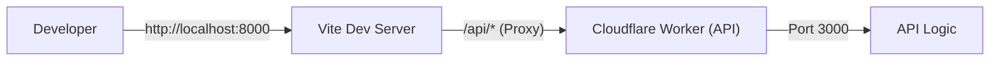
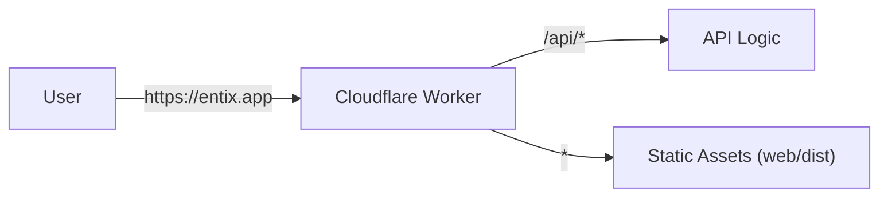

# **Entix-App**

Entix-App is a full-stack application built on **Cloudflare Workers** (API) and a **Vite + React** frontend (web).

- **Development**: Runs as two separate processes (Vite + Wrangler) for a fast developer experience.
- **Production**: Bundles into a **single Cloudflare Worker** that serves both the API and the static frontend assets.

---

## **Architecture**

### **Development Architecture**
In development, we run two separate servers. Vite proxies API requests to the Worker.



### **Production Architecture**
In production, everything is deployed as a single unit. The Worker handles routing for both API endpoints and static files.



---

## **Project Structure**

```
entix-app/
 ├── src/              # Worker API source code
 ├── web/              # Vite + React frontend
 ├── shared/           # Shared DTOs, schemas, utilities
 ├── wrangler.jsonc    # Cloudflare Worker config
 └── package.json      # Root package manager config
```

### **Shared Code**
The `shared` directory contains code used by **both** the API and the Web (e.g., Zod schemas, DTO types).
- Import via: `import { UserDTO } from "@shared";`
- No build step required; resolved automatically by `vite-tsconfig-paths` and Wrangler.

- No build step required; resolved automatically by `vite-tsconfig-paths` and Wrangler.

---

## **Routing Architecture**

We follow a strict **3-file pattern** for defining API routes to ensure type safety and separation of concerns.

### **1. Route Definition (`*.routes.ts`)**
Defines the OpenAPI specification for the route using `createRoute`. This includes the path, method, request validation (body/query/params), and response schemas.

**Important**: Validation schemas MUST be defined in the `request` object (e.g., `request.body`, `request.query`) for type inference to work correctly. Do **not** use `middleware` for validation if you want type safety in handlers.

```typescript
// users/user.routes.ts
export class UserRoutes {
    static create = createRoute({
        tags: ['Users'],
        method: 'post',
        path: '/users',
        request: {
            body: jsonContentRequired(userSchema, 'User to create'),
        },
        responses: {
            [HttpStatusCodes.OK]: jsonContent(userSchema.array(), 'List of users'),
        },
    });
}
```

### **2. Route Handler (`*.handlers.ts`)**
Implements the logic for the route. We use the `AppHandler` type generic to infer the `Context` type from the route definition.

```typescript
// users/user.handlers.ts
export class UserHandler {
    // Type inference works! 'c.req.valid' knows the shape of the body.
    static create: AppHandler<typeof UserRoutes.create> = async (c) => {
        const { username, email } = c.req.valid('json'); 
        // ... logic ...
        return c.json([...], HttpStatusCodes.OK);
    }
}
```

### **3. Route Index (`*.index.ts`)**
Binds the route definition to the handler using `createRouter().openapi()`. This is where the actual Hono router is constructed.

```typescript
// users/users.index.ts
export const userRoutes = createRouter()
    .openapi(UserRoutes.create, UserHandler.create);
```

## **Development Workflow**

### **1. Setup**
Install dependencies for the root, API, and Web:

```bash
npm run dev:init
# Or manually:
# npm install && cd web && npm install
```

### **2. Run Locally**
Start both the API and Web servers concurrently:

```bash
npm run dev
```

- **Web**: [http://localhost:8000](http://localhost:8000)
- **API**: [http://localhost:3000](http://localhost:3000)

### **3. API Usage**
The frontend is configured to proxy `/api` requests to the backend. **Always use relative paths** in your frontend code:

```typescript
// ✅ Correct
const res = await axios.get("/api/v1/users");

// ❌ Incorrect (Don't hardcode localhost)
const res = await axios.get("http://localhost:3000/api/v1/users");
```

---

## **Deployment**

We use **Cloudflare Environments** to separate Staging and Production.

### **Staging (Preview)**
- **Trigger**: Automatic on every Pull Request.
- **Mechanism**: Cloudflare GitHub Integration builds and deploys a **Preview Worker**.
- **Environment**: Uses the `staging` environment in `wrangler.jsonc`.
- **Isolation**: Has separate D1 databases, KV namespaces, and R2 buckets from production.

### **Production**
- **Trigger**: Manual deployment.
- **Command**:
  ```bash
  npm run deploy
  ```
- **Mechanism**: Builds the frontend (`web/dist`) and deploys the Worker with assets to the `prod` environment.

### **Environment Configuration**
`wrangler.jsonc` defines the environments:

```jsonc
"env": {
  "staging": { ... }, // Uses preview databases/assets
  "prod": { ... }     // Uses production databases/assets
}
```

---

## **Error Handling & Validation**

The API uses a unified error handling strategy to ensure consistent responses.

### **Response Format**
All errors follow this JSON structure:

```json
{
  "success": false,
  "message": "Error description",
  "details": { ... }, // Optional validation details
  "status": 400
}
```

### **Validation**
We use **Zod** and **@hono/zod-openapi** for request validation.

**Crucial**: To ensure type safety in your handlers, you must define validation schemas within the `createRoute` definition object under the `request` property.

- **Body**: `request.body.content['application/json'].schema`
- **Query**: `request.query`
- **Params**: `request.params`
- **Headers**: `request.headers`

**Do NOT** use the `validator` middleware directly in the `middleware` array of `createRoute` if you want TypeScript to infer the input types in your handler. The `AppHandler` type relies on the `request` property of the route config.

```typescript
// ✅ Correct: Type inference works
createRoute({
  request: {
    body: jsonContentRequired(userSchema, '...'),
  }
})

// ❌ Incorrect: No type inference in handler
createRoute({
  middleware: [validator('json', userSchema)] 
})
```

### **404 Handling**
Routes that do not exist return a standard 404 response generated by the central error handler.

---

## **API Documentation**

The API is fully documented using **OpenAPI 3.1.0**.

- **OpenAPI Specification (JSON)**: [https://entix.org/api/v1/openapi](https://entix.org/api/v1/openapi)
  - Raw JSON definition of all API endpoints, schemas, and responses.
- **Interactive API Reference**: [https://entix.org/api/v1/api-reference](https://entix.org/api/v1/api-reference)
  - A beautiful, interactive documentation page powered by **Scalar**.
  - You can **test API endpoints** directly from the browser, view request/response schemas, and generate client code snippets.

---

## **Scripts Reference**

| Script | Description |
| :--- | :--- |
| `npm run dev` | Starts API and Web in development mode. |
| `npm run dev:init` | Installs all dependencies (Root + Web). |
| `npm run build:web` | Builds the React frontend to `web/dist`. |
| `npm run deploy` | Builds web and deploys to **Production**. |
| `npm run deploy:staging` | Builds web and deploys to **Staging** (manual trigger). |
