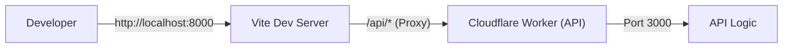
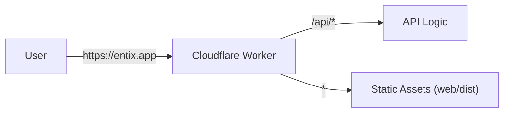

# Entix-App

Entix-App is a full-stack application built on **Cloudflare Workers** (API) and **Vite + React** (frontend).

## Table of Contents

1. [Overview](#overview)
2. [Quick Start](#quick-start)
3. [Environment Variables](#environment-variables)
4. [Architecture](#architecture)
5. [Project Structure](#project-structure)
6. [Database](#database)
7. [Routing Architecture](#routing-architecture)
8. [Error Handling & Validation](#error-handling--validation)
9. [Development Workflow](#development-workflow)
10. [Deployment](#deployment)
11. [Scripts Reference](#scripts-reference)
12. [API Documentation](#api-documentation)

---

## Overview

This is a full-stack web application where:
- **Backend API**: Hosted on Cloudflare Workers
- **Frontend**: Built with Vite and React
- **Database**: Cloudflare D1 (SQLite)

**Development**: Runs as two separate processes (Vite + Wrangler) for fast iteration.  
**Production**: Deployed as a single Cloudflare Worker serving both API and static assets.

---

## Quick Start

### Setup
Install dependencies for both root and web projects:

```bash
npm run dev:init
```

### Run Development Server
Start both API and web servers:

```bash
npm run dev
```

- **Web**: [http://localhost:8000](http://localhost:8000)
- **API**: [http://localhost:3000](http://localhost:3000)

### Initialize Database
The local database is automatically created by Miniflare when you:
1. Start `npm run dev`
2. Hit an API endpoint that accesses the database

After the database is created, apply migrations:

```bash
npm run db:migrate:development
```

---

## Environment Variables

### Local Development Configuration

Create a `.dev.vars` file in the project root for local development environment variables.

**Example `.dev.vars`:**

```bash
# Local D1 Database Identifier
# This is the SQLite filename created by Miniflare in .wrangler/state/v3/d1/miniflare-D1DatabaseObject/
CLOUDFLARE_D1_LOCAL_DB=your-database-id-here.sqlite
```

**Important Notes:**
- `.dev.vars` is gitignored and should **never** be committed
- This file is only used for local development
- The `CLOUDFLARE_D1_LOCAL_DB` variable tells Drizzle which local SQLite file to use
- To find your database ID, check `.wrangler/state/v3/d1/miniflare-D1DatabaseObject/` after running `npm run dev` and hitting a database endpoint

---

## Architecture

### Development Architecture
In development, two separate servers run concurrently. Vite proxies API requests to the Worker.



### Production Architecture
In production, a single Worker handles both API requests and static file serving.



---

## Project Structure

```
entix-app/
 ├── api/              # Worker API source code
 ├── web/              # Vite + React frontend
 ├── shared/           # Shared DTOs, Zod schemas, types
 ├── wrangler.jsonc    # Cloudflare Worker configuration
 └── package.json      # Root package manager config
```

### Shared Code
The `shared/` directory contains code used by **both** `api/` and `web/`:
- Zod schemas for validation
- TypeScript types and DTOs
- Shared utilities

**Import**: `import { UserDTO } from "@shared";`  
**Build**: No build step required; resolved automatically by `vite-tsconfig-paths` and Wrangler.

---

## Database

### Environments
The project uses **Cloudflare D1** (SQLite) across three environments:

| Environment | Database | Binding |
|:---|:---|:---|
| **Development** | Local SQLite (Miniflare) | `DB` |
| **Staging** | `entix-app-staging` (Cloudflare D1) | `DB` |
| **Production** | `entix-app-production` (Cloudflare D1) | `DB` |

All environments use the same binding name: `DB`.

### Local Database (Development)

**Location**: `.wrangler/state/v3/d1/miniflare-D1DatabaseObject/`

The local database is **automatically created** by Miniflare, but only after:
1. `npm run dev` is running
2. An API endpoint that accesses the database is hit

**Important**: Drizzle must point to this exact SQLite file for migrations to work correctly.

#### Handling Local Database Drift

If you encounter issues where migrations appear applied but tables are missing:

1. **Stop** the dev server
2. **Delete** `.wrangler/` directory
3. **Restart** `npm run dev`
4. **Hit** a database-backed endpoint (to recreate the DB file)
5. **Re-apply** migrations: `npm run db:migrate:development`

### Database Tools

- **Drizzle Kit**: Generates migration files (`.sql`) from `schema.db.ts`. **Never applies migrations.**
- **Wrangler**: Applies migrations to local and remote databases.

**Rule**: Drizzle generates, Wrangler applies.

### Database Workflow

1. **Modify schema**: Edit `api/db/schema.db.ts`
2. **Generate migration**: `npm run db:generate`
3. **Apply migration**:
   - Development: `npm run db:migrate:development`
   - Staging: `npm run db:migrate:staging`
   - Production: `npm run db:migrate:production`

---

## Routing Architecture

The API follows a strict **3-file pattern** for type-safe route definitions.

### 1. Route Definition (`*.routes.ts`)
Defines the OpenAPI specification using `createRoute`.

**Rule**: Validation schemas **MUST** be in `request.body`, `request.query`, `request.params`, or `request.headers`.  
**Rule**: Do **NOT** use validator middleware; it breaks type inference.

```typescript
// users/user.routes.ts
export class UserRoutes {
    static create = createRoute({
        tags: ['Users'],
        method: 'post',
        path: '/users',
        request: {
            body: jsonContentRequired(userSchema, 'User to create'),
        },
        responses: {
            [HttpStatusCodes.OK]: jsonContent(userSchema.array(), 'List of users'),
        },
    });
}
```

### 2. Route Handler (`*.handlers.ts`)
Implements route logic with automatic type inference.

**Rule**: Use `AppHandler<typeof Route>` to infer types from the route definition.

```typescript
// users/user.handlers.ts
export class UserHandler {
    static create: AppHandler<typeof UserRoutes.create> = async (c) => {
        const { username, email } = c.req.valid('json'); // Fully typed!
        // ... logic ...
        return c.json([...], HttpStatusCodes.OK);
    }
}
```

### 3. Route Index (`*.index.ts`)
Binds routes to handlers using `createRouter().openapi()`.

```typescript
// users/users.index.ts
export const userRoutes = createRouter()
    .openapi(UserRoutes.create, UserHandler.create);
```

---

## Error Handling & Validation

### Centralized Error Handling
All errors return a standardized JSON response:

```json
{
  "success": false,
  "message": "Error description",
  "details": { ... },
  "status": 400
}
```

### Validation Rules
We use **Zod** and **@hono/zod-openapi** for request validation.

**Critical**: Validation schemas must be defined in the `request` property of `createRoute`:

```typescript
// ✅ Correct: Type inference works
createRoute({
  request: {
    body: jsonContentRequired(userSchema, 'User data'),
  }
})

// ❌ Incorrect: No type inference
createRoute({
  middleware: [validator('json', userSchema)]
})
```

**Validation locations**:
- **Body**: `request.body.content['application/json'].schema`
- **Query**: `request.query`
- **Params**: `request.params`
- **Headers**: `request.headers`

### 404 Handling
Non-existent routes return a standard 404 response from the central error handler.

---

## Development Workflow

### 1. Install Dependencies
```bash
npm run dev:init
```

### 2. Start Development Servers
```bash
npm run dev
```

### 3. Initialize Local Database
Make a request to the API (e.g., open the web app) to trigger Miniflare database creation.

### 4. Apply Migrations
```bash
npm run db:migrate:development
```

### 5. Develop Features
- Create/modify routes in `api/routes/`
- Update schemas in `api/db/schema.db.ts`
- Generate migrations: `npm run db:generate`
- Apply migrations: `npm run db:migrate:development`

### 6. Frontend API Usage
Always use **relative paths** in frontend code:

```typescript
// ✅ Correct
const res = await axios.get("/api/v1/users");

// ❌ Incorrect (Don't hardcode localhost)
const res = await axios.get("http://localhost:3000/api/v1/users");
```

---

## Deployment

### Environments

| Environment | Trigger | Command | Database |
|:---|:---|:---|:---|
| **Staging** | Automatic (PR) | `npm run deploy:staging` | `entix-app-staging` |
| **Production** | Manual | `npm run deploy:production` | `entix-app-production` |

### Staging (Preview)
- **Trigger**: Automatic on every Pull Request via Cloudflare GitHub Integration
- **Environment**: Uses `staging` environment in `wrangler.jsonc`
- **Isolation**: Separate D1 databases, KV namespaces, and R2 buckets

### Production
- **Trigger**: Manual deployment
- **Command**: `npm run deploy:production`
- **Process**: Applies migrations → Builds frontend → Deploys Worker with assets

### Environment Configuration
Defined in `wrangler.jsonc`:

```jsonc
"env": {
  "development": { ... },  // Local development
  "staging": { ... },      // Preview deployments
  "production": { ... }    // Production deployments
}
```

### Cloudflare Credentials
**Not required** for local development or CI/CD. Wrangler handles authentication implicitly.

---

## Scripts Reference

| Script | Description |
|:---|:---|
| `npm run dev` | Starts API and Web in development mode |
| `npm run dev:init` | Installs all dependencies (Root + Web) |
| `npm run dev:api` | Starts only the API server (Wrangler) |
| `npm run dev:web` | Starts only the Web server (Vite) |
| `npm run build:web` | Builds the React frontend to `web/dist` |
| `npm run db:generate` | Generates SQL migrations from `schema.db.ts` |
| `npm run db:studio` | Opens Drizzle Studio for database inspection |
| `npm run db:migrate:development` | Applies migrations to local Miniflare database |
| `npm run db:migrate:staging` | Applies migrations to staging D1 database |
| `npm run db:migrate:production` | Applies migrations to production D1 database |
| `npm run deploy:staging` | Migrates DB + deploys to Staging |
| `npm run deploy:production` | Migrates DB + deploys to Production |
| `npm run cf-typegen` | Generates TypeScript types for Cloudflare bindings |

---

## API Documentation

The Worker serves OpenAPI documentation:

- **OpenAPI Specification (JSON)**: [/api/v1/openapi](/api/v1/openapi)
  - Raw JSON definition of all endpoints, schemas, and responses
- **Interactive API Reference**: [/api/v1/api-reference](/api/v1/api-reference)
  - Interactive documentation powered by **Scalar**
  - Test endpoints directly from the browser
  - View request/response schemas
  - Generate client code snippets

---

## Troubleshooting

### Local Database Issues
If tables are missing or migrations aren't applying:
1. Stop `npm run dev`
2. Delete `.wrangler/` directory
3. Restart `npm run dev`
4. Hit a database endpoint to recreate the DB
5. Run `npm run db:migrate:development`

### Type Inference Not Working
Ensure validation schemas are in `createRoute.request`, not in middleware.

### Frontend Can't Reach API
Verify you're using relative paths (`/api/v1/...`) not absolute URLs.
