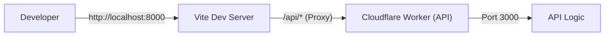
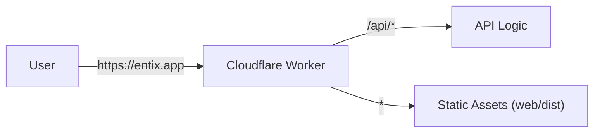

# Architecture & Structure


## Architecture

### Development Architecture
In development, two separate servers run concurrently. Vite proxies API requests to the Worker.



### Production Architecture
In production, a single Worker handles both API requests and static file serving.



---

## Project Structure

```
entix-app/
 ├── api/              # Worker API source code
 ├── web/              # Vite + React frontend
 ├── shared/           # Shared DTOs, Zod schemas, types
 ├── wrangler.jsonc    # Cloudflare Worker configuration
 └── package.json      # Root package manager config
```

### Shared Code
The `shared/` directory contains code used by **both** `api/` and `web/`:
- Zod schemas for validation
- TypeScript types and DTOs
- Shared utilities

**Import**: `import { UserDTO } from "@shared";`  
**Build**: No build step required; resolved automatically by `vite-tsconfig-paths` and Wrangler.

---

## Routing Architecture

The API follows a strict **3-file pattern** for type-safe route definitions.

### 1. Route Definition (`*.routes.ts`)
Defines the OpenAPI specification using `createRoute`.

**Rule**: Validation schemas **MUST** be in `request.body`, `request.query`, `request.params`, or `request.headers`.  
**Rule**: Do **NOT** use validator middleware; it breaks type inference.
**Rule**: Always import `z` from `@hono/zod-openapi` (not `zod`) to ensure `.openapi()` method support.

```typescript
// ✅ Correct
import { z } from '@hono/zod-openapi';

// ❌ Incorrect
import { z } from 'zod';
```

```typescript
// users/user.routes.ts
export class UserRoutes {
    static create = createRoute({
        tags: ['Users'],
        method: 'post',
        path: '/users',
        request: {
            body: jsonContentRequired(userSchema, 'User to create'),
        },
        responses: {
            [HttpStatusCodes.OK]: jsonContent(userSchema.array(), 'List of users'),
        },
    });
}
```

### 2. Route Handler (`*.handlers.ts`)
Implements route logic with automatic type inference.

**Rule**: Use `AppHandler<typeof Route>` to infer types from the route definition.

```typescript
// users/user.handlers.ts
export class UserHandler {
    static create: AppHandler<typeof UserRoutes.create> = async (c) => {
        const { username, email } = c.req.valid('json'); // Fully typed!
        // ... logic ...
        return c.json([...], HttpStatusCodes.OK);
    }
}
```

### 3. Route Index (`*.index.ts`)
Binds routes to handlers using `createRouter().openapi()`.

```typescript
// users/users.index.ts
export const userRoutes = createRouter()
    .openapi(UserRoutes.create, UserHandler.create);
```

---

## Middleware Stack

Middleware processes requests before they reach route handlers. Execution order matters!

**File**: `api/lib/app.lib.ts`

```typescript
export const createApp = () => {
    const app = new OpenAPIHono<AppEnv>({ strict: false });

    // 1. CORS - Must be first for preflight requests
    app.use('*', cors({ ... }));

    // 2. Logger - Logs all requests
    app.use(logger());

    // 3. Not Found - Catches unmatched routes
    app.notFound(notFoundHandler);

    // 4. Error Handler - Catches all errors
    app.onError(globalErrorHandler);

    return app;
};
```

### Middleware Components

1. **CORS Middleware**: Validates request origins and handles preflight
2. **Logger Middleware**: Logs HTTP requests using hono-pino
3. **Not Found Handler**: Returns 404 for non-existent routes
4. **Global Error Handler**: Catches and formats all errors

For detailed middleware documentation, see [Middleware](./middleware.md).

---

## Error Handling Architecture

### AppError Class

**File**: `api/errors/app.error.ts`

Custom application error class for throwing business logic errors:

```typescript
export class AppError extends Error {
    constructor(
        public message: string,
        public status: number = 500,
        public details?: Record<string, unknown>
    ) {
        super(message);
        this.name = 'AppError';
    }
}
```

**Usage**:
```typescript
// Simple error
throw new AppError('User not found', 404);

// Error with details
throw new AppError('Insufficient balance', 400, { 
    current: 100, 
    required: 200 
});
```

### Standardized Error Response

All errors return this format:

```json
{
  "success": false,
  "message": "Error description",
  "details": { }  // Optional
}
```

### Error Types

1. **Validation Errors** (Zod): 400 Bad Request with field-level details
2. **AppError**: Custom status code with optional details
3. **Generic Errors**: 500 Internal Server Error

For complete error handling documentation, see [Middleware](./middleware.md).

---

## Shared Code Architecture

The `shared/` directory contains code used by **both** the API and frontend.

### Structure

```
shared/
├── schemas/
│   └── dto/
│       ├── user.dto.ts
│       └── ...
├── auth/
└── index.ts
```

### Path Alias

Both API and frontend use the `@shared` alias:

```typescript
// In API
import { UserDTO } from '@shared';

// In Frontend
import type { UserDTO } from '@shared';
```

### Configuration

**vitest.config.ts** and **tsconfig.json**:
```typescript
alias: {
  "@api": "./api",
  "@shared": "./shared",
  "@web": "./web",
}
```

### Best Practices

1. **DTOs and Schemas**: Define shared Zod schemas in `shared/schemas/dto/`
2. **Type Safety**: Export TypeScript types derived from Zod schemas
3. **No Business Logic**: Shared code should be data structures and types only
4. **Import Pattern**: Always import named exports, not default exports

**Example** (`shared/schemas/dto/user.dto.ts`):
```typescript
import { z } from '@hono/zod-openapi';

export const userSchema = z.object({
  id: z.string().uuid(),
  name: z.string(),
  email: z.string().email(),
});

export type UserDTO = z.infer<typeof userSchema>;
```

