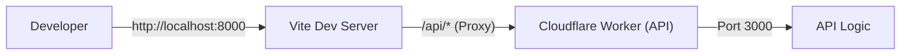
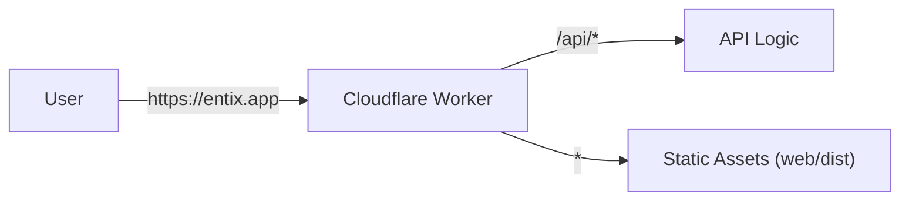

# Architecture & Structure

[← Back to Table of Contents](../README.md)


## Architecture

### Development Architecture
In development, two separate servers run concurrently. Vite proxies API requests to the Worker.



### Production Architecture
In production, a single Worker handles both API requests and static file serving.



---

## Project Structure

```
entix-app/
 ├── api/              # Worker API source code
 ├── web/              # Vite + React frontend
 ├── shared/           # Shared DTOs, Zod schemas, types
 ├── wrangler.jsonc    # Cloudflare Worker configuration
 └── package.json      # Root package manager config
```

### Shared Code
The `shared/` directory contains code used by **both** `api/` and `web/`:
- Zod schemas for validation
- TypeScript types and DTOs
- Shared utilities

**Import**: `import { UserDTO } from "@shared";`  
**Build**: No build step required; resolved automatically by `vite-tsconfig-paths` and Wrangler.

---

## Routing Architecture

The API follows a strict **3-file pattern** for type-safe route definitions.

### 1. Route Definition (`*.routes.ts`)
Defines the OpenAPI specification using `createRoute`.

**Rule**: Validation schemas **MUST** be in `request.body`, `request.query`, `request.params`, or `request.headers`.  
**Rule**: Do **NOT** use validator middleware; it breaks type inference.
**Rule**: Always import `z` from `@hono/zod-openapi` (not `zod`) to ensure `.openapi()` method support.

```typescript
// ✅ Correct
import { z } from '@hono/zod-openapi';

// ❌ Incorrect
import { z } from 'zod';
```

```typescript
// users/user.routes.ts
export class UserRoutes {
    static create = createRoute({
        tags: ['Users'],
        method: 'post',
        path: '/users',
        request: {
            body: jsonContentRequired(userSchema, 'User to create'),
        },
        responses: {
            [HttpStatusCodes.OK]: jsonContent(userSchema.array(), 'List of users'),
        },
    });
}
```

### 2. Route Handler (`*.handlers.ts`)
Implements route logic with automatic type inference.

**Rule**: Use `AppHandler<typeof Route>` to infer types from the route definition.

```typescript
// users/user.handlers.ts
export class UserHandler {
    static create: AppHandler<typeof UserRoutes.create> = async (c) => {
        const { username, email } = c.req.valid('json'); // Fully typed!
        // ... logic ...
        return c.json([...], HttpStatusCodes.OK);
    }
}
```

### 3. Route Index (`*.index.ts`)
Binds routes to handlers using `createRouter().openapi()`.

```typescript
// users/users.index.ts
export const userRoutes = createRouter()
    .openapi(UserRoutes.create, UserHandler.create);
```
