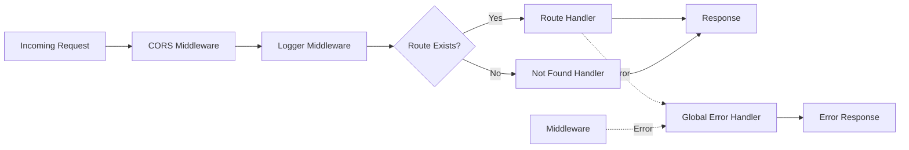

# Middleware

Middleware in Entix-App is built using [Hono](https://hono.dev/) and processes requests in a specific order before they reach route handlers.

## Middleware Execution Order



## CORS Middleware

**File**: `api/lib/app.lib.ts`

The CORS middleware is configured to allow cross-origin requests from specific origins during development and production.

### Configuration

```typescript
app.use('*', cors({
    origin: (origin, c) => {
        const allowedOrigins = [
            'http://localhost:3000',     // API server
            'http://localhost:8000',     // Vite dev server
            c.env.FRONTEND_URL,          // Dynamic frontend URL
            'https://entix.org',         // Production
            'https://staging.entix.org'  // Staging
        ];
        return allowedOrigins.includes(origin) ? origin : null;
    },
    allowMethods: ['GET', 'POST', 'PUT', 'DELETE', 'OPTIONS'],
    allowHeaders: ['Content-Type', 'Authorization', 'Origin', 'Accept'],
    exposeHeaders: ['Content-Length', 'X-Kuma-Revision'],
    maxAge: 600,
    credentials: true,
}));
```

### Key Points

- **Dynamic Origin Check**: Uses a function to validate origins against an allowlist
- **Environment Awareness**: Includes `c.env.FRONTEND_URL` for environment-specific origin
- **Credentials Support**: `credentials: true` allows cookies and authentication headers
- **Preflight Caching**: `maxAge: 600` caches preflight responses for 10 minutes
- **Security**: Rejects requests from unlisted origins by returning `null`

### Why This Matters

In development, Vite serves the frontend on `localhost:8000` while the API runs on `localhost:3000`. CORS allows the frontend to make API requests despite different ports.

## Logger Middleware

**File**: `api/middleware/logger.middleware.ts`

Uses [hono-pino](https://github.com/maou-shonen/hono-pino) for structured logging.

### Configuration

```typescript
import { logger as pinoLogger } from 'hono-pino';

export const logger = () => pinoLogger({
    pino: pino({
        level: 'info',
    }),
});
```

### What Gets Logged

- **HTTP Requests**: Method, path, status code, response time
- **Request ID**: Unique identifier for each request
- **Timestamp**: ISO 8601 formatted timestamp
- **User Agent**: Client information

### Log Format

Logs are output in JSON format for easy parsing:

```json
{
  "level": 30,
  "time": 1708100000000,
  "pid": 1,
  "hostname": "worker",
  "method": "GET",
  "path": "/api/v1/users",
  "status": 200,
  "duration": 45
}
```

### Log Levels

- **`info`** (default): Standard request/response logging
- **`warn`**: Potential issues
- **`error`**: Error conditions

## Global Error Handler

**File**: `api/middleware/global-error.middleware.ts`

Catches all errors thrown during request processing and returns standardized error responses.

### Error Types Handled

#### 1. Zod Validation Errors

When request validation fails, Zod throws a `ZodError`:

```typescript
if (err instanceof ZodError) {
    const flattened = z.treeifyError(err);
    return c.json(
        {
            success: false,
            message: 'Validation failed',
            details: 'properties' in flattened ? flattened.properties : flattened,
        },
        { status: 400 }
    );
}
```

**Example Response**:
```json
{
  "success": false,
  "message": "Validation failed",
  "details": {
    "email": "Invalid email format",
    "password": "Must be at least 8 characters"
  }
}
```

#### 2. Custom AppError

For application-specific errors, use the `AppError` class:

```typescript
if (err instanceof AppError) {
    return c.json(
        {
            success: false,
            message: err.message,
            ...(err.details ? { details: err.details } : {}),
        },
        err.status
    );
}
```

**AppError Definition** (`api/errors/app.error.ts`):
```typescript
export class AppError extends Error {
    constructor(
        public message: string,
        public status: number = 500,
        public details?: Record<string, unknown>
    ) {
        super(message);
        this.name = 'AppError';
    }
}
```

**Usage Example**:
```typescript
throw new AppError('User not found', 404);
throw new AppError('Insufficient balance', 400, { current: 100, required: 200 });
```

#### 3. Generic Errors

All other errors are caught and returned as 500 Internal Server Error:

```typescript
return c.json(
    {
        success: false,
        message: 'Internal Server Error',
    },
    500
);
```

### Standardized Error Response Format

All errors follow this structure:

```typescript
{
  success: boolean;      // Always false for errors
  message: string;       // Human-readable error message
  details?: object;      // Optional additional error information
}
```

### Error Logging

All errors are logged to the console before being returned:

```typescript
console.error('Caught error:', err);
```

This helps with debugging while ensuring users don't see sensitive stack traces.

## Not Found Handler

**File**: `api/middleware/not-found.middleware.ts`

Returns a standardized 404 response for routes that don't exist.

### Implementation

```typescript
export const notFoundHandler = (c: Context) => {
    return c.json(
        {
            success: false,
            message: 'Not Found',
        },
        404
    );
};
```

### When It's Triggered

- When a request matches no defined routes
- After all route handlers are checked
- Before the global error handler

**Example**:
```bash
GET /api/v1/nonexistent
→ 404 Not Found
{
  "success": false,
  "message": "Not Found"
}
```

## Middleware Registration

Middleware is registered in `api/lib/app.lib.ts` in the `createApp()` function:

```typescript
export const createApp = () => {
    const app = new OpenAPIHono<AppEnv>({ strict: false });

    // 1. CORS (first - allows preflight)
    app.use('*', cors({ ... }));

    // 2. Logger (logs all requests)
    app.use(logger());

    // 3. Not Found (catches unmatched routes)
    app.notFound(notFoundHandler);

    // 4. Error Handler (catches all errors)
    app.onError(globalErrorHandler);

    return app;
};
```

**Important**: Order matters! CORS must run first to handle preflight OPTIONS requests.
